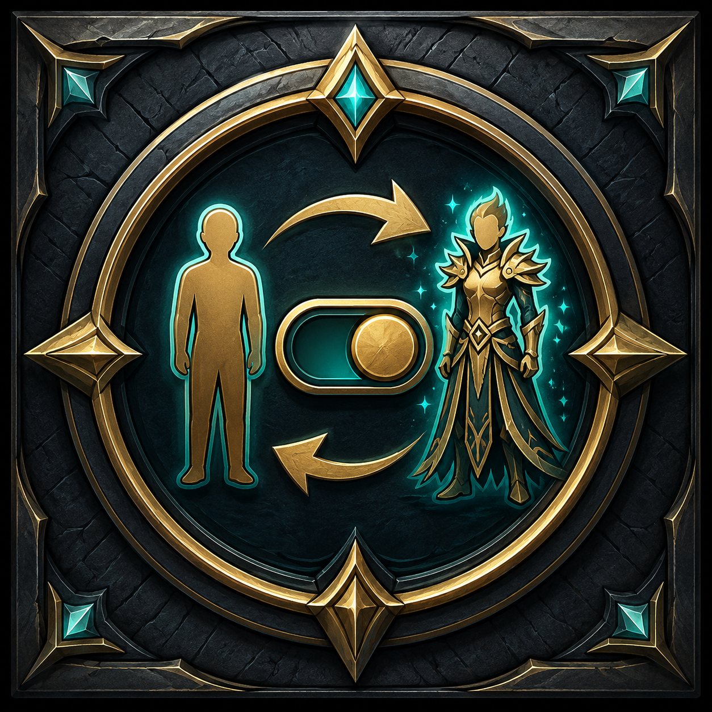

# Toggle Appearance


**Toggle Appearance** is a lightweight ArcheAge Classic addon that adds a simple button for turning default player appearances on and off.

## Features

- One-click toggle for default player appearances
- **Default Appearances OFF** uses the lower display setting
- **Default Appearances ON** uses the 100-player display setting
- No extra configuration required

## Installation

1. Download the latest release.
2. Extract the `DefaultAppearances` folder.
3. Place it inside your ArcheAge Classic `addons` folder.
4. Add this line to `addons.txt`:

```text
DefaultAppearances
```

Expected path:

```text
addons/DefaultAppearances/main.lua
```

## Addon info

```lua
name = "DefaultAppearances"
author = "Dope"
version = "1.0.5"
desc = "Easy toggle on and off for default appearances. Button looks and placement comes from Unsafe Portals by Notuli."
```

## Credits

Button looks and placement comes from **Unsafe Portals** by **Notuli**.

## Preview


